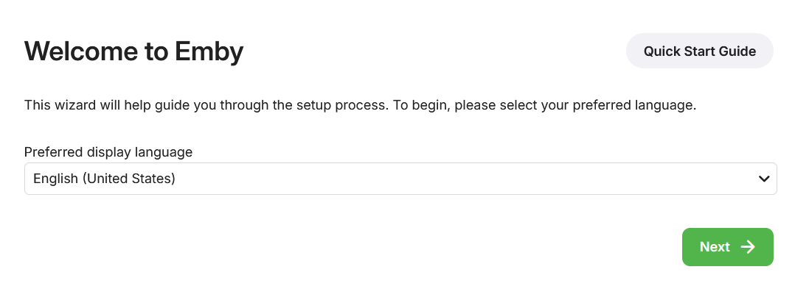
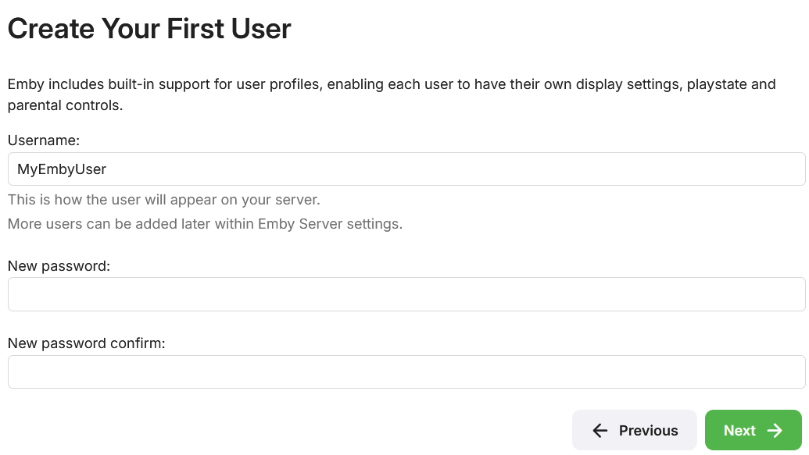
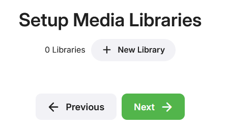
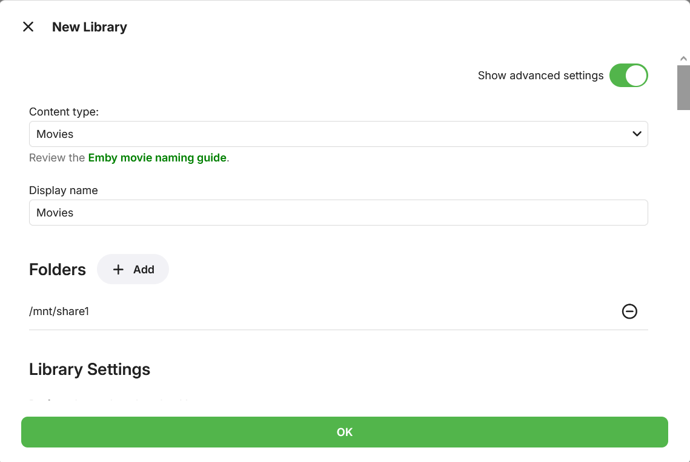
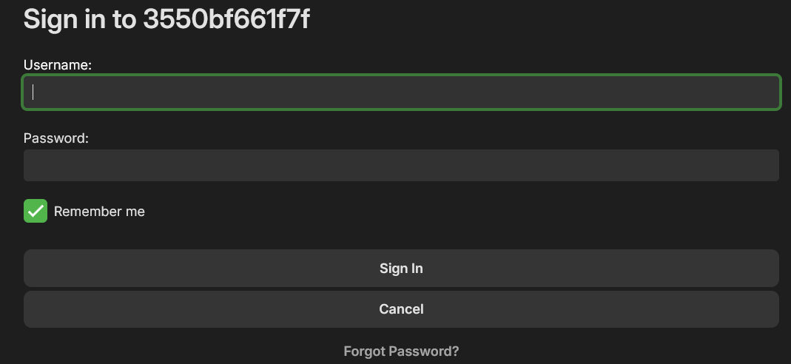
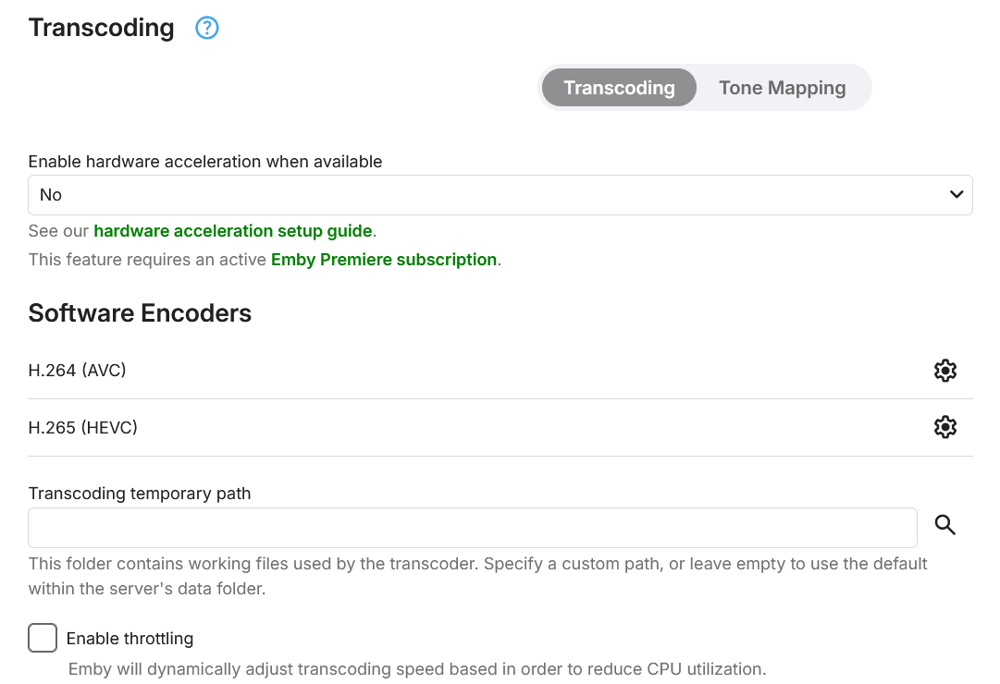
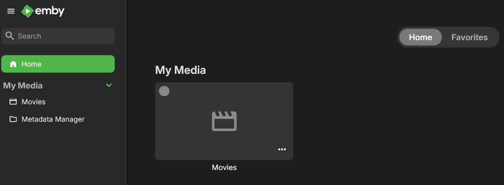

# emby-arm32v7

Works on both arm32v7 and aarch64 devices.

Tested on rk322x-box Armbian 22.11.1 (Debian 10)

Tested on Orange Pi 3B Ubuntu 24.04.

## Enable DLNA and Wake-on-Lan

Start project from host.yml file:

````
docker-compose -f docker-compose-host.yml up -d
````

## Transcoding

Typical home networks (100/1000mbps) can handle 1080p even 4k media smoothly without transcoding.

So I don't recommend transcoding media inside your home server.

If you really wanna do it, I don't think PIs devices (Rasp or Orange) are capable.

I recommend you get a mini PC x86_64 with good Intel (quicksync) or AMD (vaapi) APU for this task.

## kodi
On my personal use, I prefer watch my media on external player Kodi.

It works pretty good with add-on "embycon":

https://kodi.emby.tv


## How to test?

Clone this project:
````
cd /opt
git clone https://github.com/primoitt83/emby-arm32v7.git
cd emby-arm32v7
docker-compose up -d
````

Go to a browser:

````
http://Your_Homeserver_IP:8096
````
`
````
Select you language:
````


````
Create a username and password:
````



````
Setup your media
````


<br>
<br>


````
Select default options on the rest.

Log in with created username.
````



````
Disable transcoding

Settings -> Transcoding -> Enable hardware acceleration when avaliable -> No -> Save
````



````
Enjoy
````




